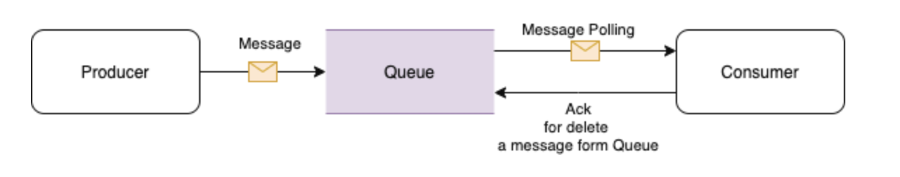

# AWS SQS(Simple Queue Service)

일반적인 Queue의 처리 과정
1. Producer는 메시지를 생성하여 Queue로 전송한다.
2. 큐는 메시지를 일정 기간 가지고 있게 된다.
3. Consumer는 주기적으로큐를 풀링 하면서 신규메시지가 있다면 가져가서 처리한다.
4. 처리가 끝나면 큐로 Ack를 전송한다. (큐에서 메시지를 제거)

## Overview
aws콘솔,CLI,SDK 활용가능
메시지 보관기간 (1분~14일)
메시지 크기(1kb~ 256kb),
2가지 타입 (Standard,FIFO)로 구성 가능
- Standard
  - 최대 처리량
  - Best effort 순서
  - 최소 1회 전달
- FIFO
  - 정확한 순서의 보장
  - 정확히 1번 실행
  - .fifo 이름을 사용해야한다.

### SQS
+ 가벼운 관리형 메시지 대기열
+ PULL(Polling)기반으로 메시지 처리(가져오기 방식)

### SNS
+ push 기반으로 실시간 전달.
+ 시간이 관건인 메시지 전달.

### Amazon MQ
+ On-Premise에서 사용하던 메시지 큐를 이관시 유리

## Amazon Kinesis Stream
+ 빅데이터 스트리밍을 실시간 처리
+ 여러 레코드 읽고 응답
+ KCL을 이용하여 파티션 키에 대한 코든 레코드를 동일한 레코드 프로세서에 제공

